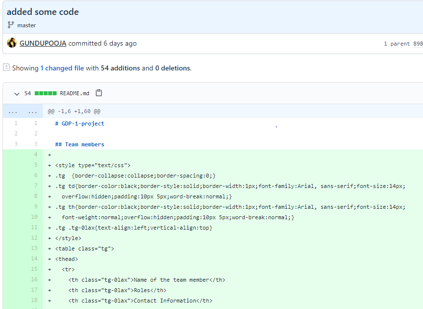
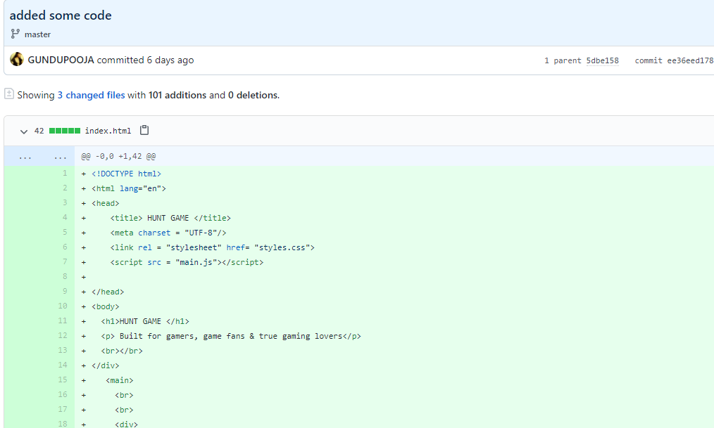
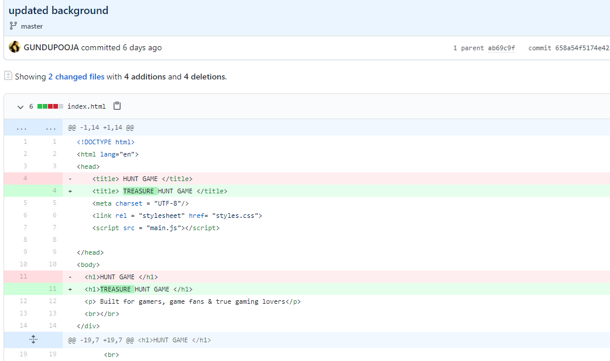
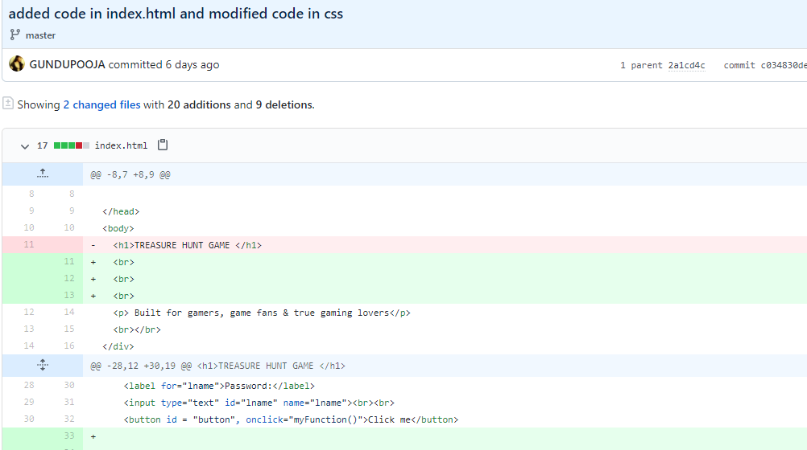
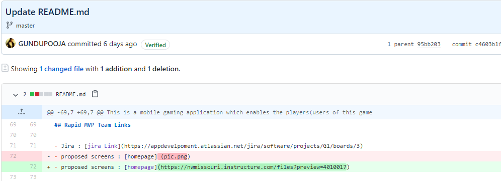

## Team Progress Report - Individual
# Project Name: Northwest Quest Hunt Game
### Name: Pooja Gundu
### 919: 919587319
### SID: s538195

## Report

## 1.	Attendance ( class periods I attended ) 
- 08-19-2020 – In person class
-	08-21-2020 – zoom session
- 08-24-2020 – In person class
-	08-26-2020 – zoom session
- 08-28-2020 – zoom doubts clarifying session 
-	For attendance I think I earned 280 points ( total 4 classes with 50 minutes each is approximately 4 hours) so, if the pay is 70$/ hour for 4 hours it is 280.

## 2.	Half day 1 
1.	After creating the repo I started checking the content in Readme.md and rectified some small spelling mistakes. 
 Here is the link to the commit 
- https://github.com/sumana-reddy/GDP-1-project/commit/3a2a1366c6cfa037b2f1362de67cb4868d022a10
2.	Added some description in Readme.md file like project client description, mentor details, client details. 
Here is the link to that commit  
- https://github.com/sumana-reddy/GDP-1-project/commit/5e5684339fb32265b57b20d8c62fceaafb4680c1

3. I created the table which includes team members name,SID,the project roles,using html table generator in google and added that code in index.html file. 
Here is the link to that commit   
* https://github.com/sumana-reddy/GDP-1-project/commit/0877043440da6bd30cfdb0c203e159a5712c72dc

4. How many points you earned in each section?
  Answer  

1. We are giving our hundred percent on our project. I am working on the website part of the project. This is the first time am working and learning app development, as I am learning new things,I am ready to work hard and do the best for the project  

2. I think I earned 280 points in this section.

## 3. Half day 2 
1.	Created index.html file and added code in file for homepage and added code in styles.css file, pushed 2 files to the Github. 

Here is the link to that commit-
 
-- https://github.com/sumana-reddy/GDP-1-project/commit/ee36eed178b54e86c25ed7cb138c7ca09b5caea2

2. Changed background image in html file and modified some cascaded style sheets( CSS ) properties for it in styles.css file  

 Here is the link to that commit 
 
-- https://github.com/sumana-reddy/GDP-1-project/commit/658a54f5174e42a5bc25fb29fe8d346737b2465b

3. Added some java script code in index.html like for example in this repo I included script for onclick() function to display a message when user clicks the button, to make the homepage look better and modified code in stylesheets file also. 

Here is the link to that commit –
 
-- https://github.com/sumana-reddy/GDP-1-project/commit/c034830de9b4df9b9d823edb1f7da1cda2e102ed

4. Added homepage screenshot with the name proposed screen in Readme.md File. Uploaded the screenshot to canvas site files and updated the image link in this file. 

Here is the link to that commit
 
 * https://github.com/sumana-reddy/GDP-1-project/commit/c4603b1f8bc00a1b1e53e39257e3a858fa8d78b3

5. How many points you earned in each section? 
Answer 

I think I earned 280 points in this section
 

